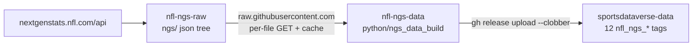
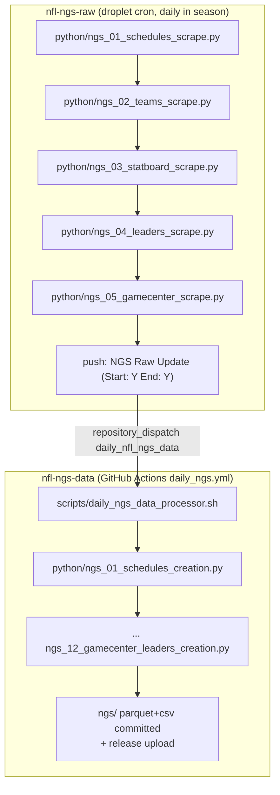

# nfl-ngs-data

Reshapes the [`nfl-ngs-raw`](https://github.com/sportsdataverse/nfl-ngs-raw)
Next Gen Stats JSON tree into released **`nfl_ngs_*`** datasets on
[`sportsdataverse-data`](https://github.com/sportsdataverse/sportsdataverse-data/releases).
The raw repo is **read over `raw.githubusercontent.com`, one file at a time,
enumerated from the raw repo's own schedule parquet** — never cloned, never
directory-listed — so the build runs on a GitHub-hosted runner in minutes.





## Datasets

| Stage | Dataset | Release tag | Grain | Floor |
|---|---|---|---|---|
| 01 | `schedules` | `nfl_ngs_schedules` | game | 2009 |
| 02 | `teams` | `nfl_ngs_teams` | team × season | 2009 |
| 03 | `passing` | `nfl_ngs_passing` | player × season_type × week (`week=0`, `scope="season"` = aggregate) | 2016 |
| 04 | `rushing` | `nfl_ngs_rushing` | same | 2016 |
| 05 | `receiving` | `nfl_ngs_receiving` | same | 2016 |
| 06 | `statboard_leaders` | `nfl_ngs_statboard_leaders` | category × rank (season scope) | 2016 |
| 07 | `leaders` | `nfl_ngs_leaders` | leaderboard × scope × week × rank — all 7 `leaders/*` families, play-level join keys (`play_game_id`, `play_play_id`) | 2016 |
| 08 | `gamecenter_passers` | `nfl_ngs_gamecenter_passers` | game × side | 2012 |
| 09 | `gamecenter_rushers` | `nfl_ngs_gamecenter_rushers` | game × side × rank | 2012 |
| 10 | `gamecenter_receivers` | `nfl_ngs_gamecenter_receivers` | game × side × rank | 2012 |
| 11 | `gamecenter_pass_rushers` | `nfl_ngs_gamecenter_pass_rushers` | game × side × rank | 2012 |
| 12 | `gamecenter_leaders` | `nfl_ngs_gamecenter_leaders` | game × category × side | 2012 |

Each tag carries per-season `{stem}_{season}.parquet` + `.csv`, a
`ngs_{dataset}_in_data_repo.csv` manifest (one row per season), and the
`timestamp` / `package_function` sidecars. Seasons are the **starting** year.
Columns are snake_case; nested objects flatten with a prefix
(`player.gsisId` → `player_gsis_id`); ids are strings except
`game_id`/`play_id`/`game_key` (ints). List-valued fields (`playStats`,
`zones`) are dropped — per-play detail with no tidy grain here.

The `leaders` column names are NGS's own (`completion_probability`,
`rush_yards_over_expected`, `max_speed`, …); descriptions are deliberately not
invented — see `sdv-internal-refs/nfl/nextgenstats/` for the captured shapes.

## Run it

```sh
uv sync --dev
uv run pytest -q                                   # offline

# one dataset/season, read raw over HTTPS (default), no publish
PYTHONPATH=python .venv/bin/python -m ngs_data_build --dataset passing -s 2024 -e 2024

# against a local raw checkout
NFL_NGS_RAW_ROOT=/path/to/nfl-ngs-raw PYTHONPATH=python .venv/bin/python -m ngs_data_build --dataset leaders -s 2016 -e 2025

# the whole thing, per season, committed + published (what CI runs)
GH_TOKEN=... bash scripts/daily_ngs_data_processor.sh -s 2025 -e 2025
```

`NFL_NGS_RAW_ROOT` is a local checkout root or the `raw.githubusercontent.com`
base (default). HTTPS reads cache under `NFL_NGS_CACHE` (default
`.ngs_raw_cache/`, gitignored) with a corrupt-entry guard.

## Automation

`daily_ngs.yml` runs on a daily cron in season (Aug–Feb, 12:45 UTC — after the
raw side's droplet cron), on `repository_dispatch` from every `nfl-ngs-raw`
push (season range parsed from the forwarded `NGS Raw Update (Start: Y End: Y)`
subject), and on `workflow_dispatch` with an explicit range for backfills.
Publishing needs the `SDV_GH_TOKEN` secret. The processor commits the built
tree per season with the load-bearing subject `NGS Data Update (Start: Y End: Y)`.

## Consumer handoff (follow-up, not in this repo)

No sdv-py / nflreadr loader reads these tags yet. The `package_function`
sidecars name the intended `sportsdataverse.nfl.load_nfl_ngs_<dataset>()`
loaders; adding them is a consumer-side PR (cached loader + returns schema).

## Layout

```
python/ngs_data_build/   config (registry), ingest (HTTPS/disk read + cache), reshapers,
                         build, io, publish, cli
python/ngs_NN_*_creation.py   numbered thin shims (intended build order)
scripts/daily_ngs_data_processor.sh   driver; scripts/_venv.sh
ngs/{dataset}/{parquet,csv}/  committed mirror of the released assets
logs/                    per-season run logs
tests/                   offline; synthetic raw tree + injected downloader
```
